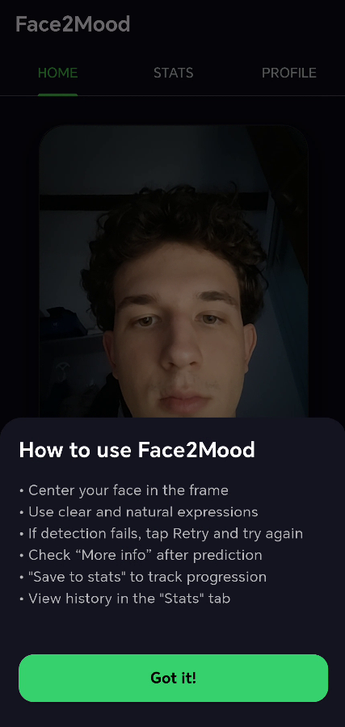
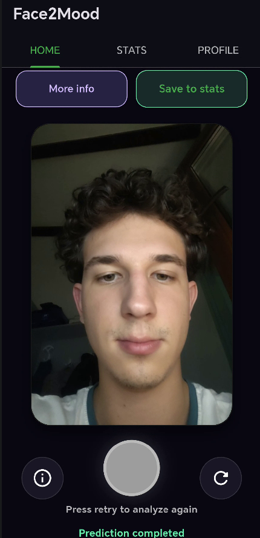
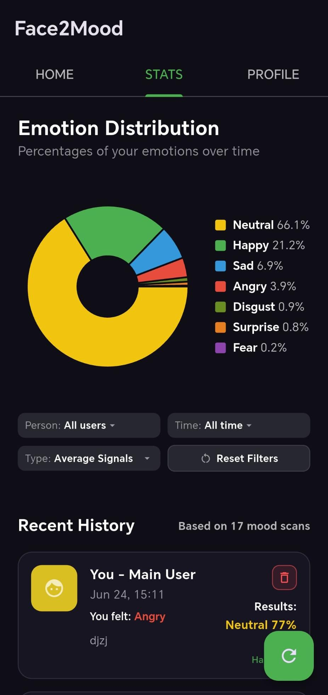
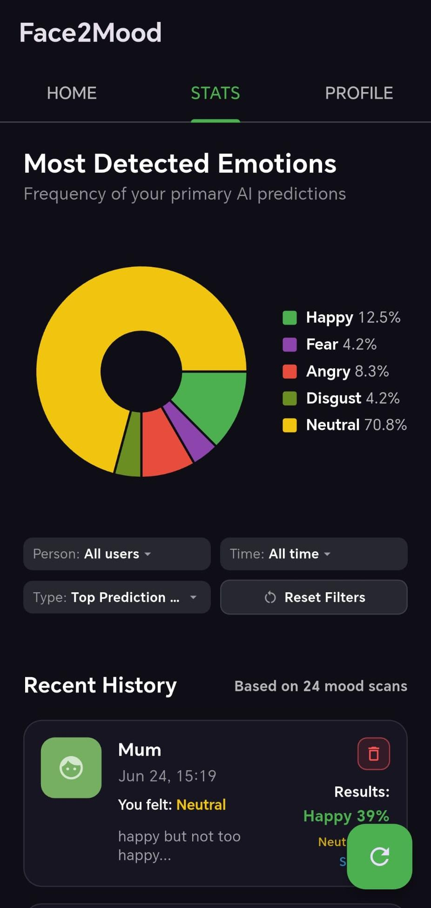

# 😊 Face2Mood: On-Device Emotional Intelligence
**A BSc Computer Science Thesis Project**

Face2Mood is a lightweight Android application for real-time **Facial Emotion Recognition (FER)** using Flutter, Google ML Kit, TensorFlow Lite, and SQLite. The project demonstrates a privacy-first approach to mobile AI inference by processing all facial data directly on the device without external server communication.

---

## 📌 Project Context

This project was developed as part of a Bachelor's Thesis in Computer Science at the **West University of Timișoara**.

The main objective was to design and implement a complete mobile Facial Emotion Recognition system capable of running directly on Android devices without external server communication, adhering to strict privacy-by-design principles and demonstrating efficient on-device deep learning inference.

---

## 🚀 Repository Highlights

- **Complete Android application** with a fully functional FER pipeline.
- **Fully on-device Deep Learning inference** (Zero latency, high privacy).
- **Lightweight TensorFlow Lite model** (<1 MB) based on RS-Xception.
- **Google ML Kit integration** for robust real-time face detection.
- **SQLite local persistence** for offline mood tracking and history.
- **Interactive statistics dashboards** for emotional trends.
- **End-to-end FER pipeline**: From raw camera pixels to emotional insights.
- **Research notebooks included** (Jupyter) for full model reproducibility.
- **Ready-to-install Android APK** provided in the repository.

---

## ✨ Main Features

- **Real-time Inference**: Facial emotion recognition performed on-device.
- **On-Device Face Detection**: Powered by Google ML Kit for high-performance localization.
- **7-Class Recognition**: Predicts *Happy, Sad, Angry, Fear, Disgust, Neutral, and Surprise*.
- **Cumulative Weighted Mapping**: Statistics are calculated using the full 7-class probability spectrum for every scan, moving beyond simple "Top-1" predictions.
- **Local Persistence**: Mood history and emotional scores stored using SQLite.
- **Emotional Intelligence Dashboards**: Detailed statistics for emotion distribution and user-model agreement.
- **Privacy-First Architecture**: No cloud inference; sensitive biometric data never leaves the device.

---

## 📖 How to Use Face2Mood

After launching the application, follow these steps:

### Step 1 — Position Your Face
- Hold the smartphone approximately 30–50 cm from your face.
- Ensure your face is fully visible within the frame.
- Use good lighting conditions (500+ lux recommended).
- Look directly at the camera.

### Step 2 — Capture an Emotion
Press the **Capture** button. The application will:
1. Detect the face using Google ML Kit.
2. Crop and preprocess the facial region.
3. Run the TensorFlow Lite model.
4. Display the Top-3 predicted emotions.

### Step 3 — View Detailed Analysis
Tap **More Info** to access:
- Confidence scores and emotional color palette.
- AI-driven emotion interpretation.
- Personalized psychological suggestions.

### Step 4 — Save the Result
Press **Save to Stats** to store the emotion record locally.

### Step 5 — Explore Statistics
Open the **Stats** page to view:
- Emotion distribution and most frequent emotions.
- User-model agreement metrics.
- Complete mood history.

### Step 6 — Manage Your Profile
The **Profile** page allows you to:
- View privacy information.
- Clear local mood history.
- Read application details.

> **Note:** All information remains stored locally on the device.

---

## ⚙️ Application Workflow

```text
Launch Application
        │
        ▼
Initialize Camera
        │
        ▼
```



```text
        │
        ▼
Google ML Kit Face Detection
        │
        ▼
   Face Cropping
        │
        ▼
48×48 Grayscale Conversion
        │
        ▼
TensorFlow Lite Inference
        │
        ▼
```



```text
        │
        ▼
Top-3 Emotion Predictions
        │
        ▼
Emotion Interpretation
        │
        ▼
```


```text
        │
        ▼
Optional Save to SQLite
        │
        ▼
Statistics Dashboard
        │
        ▼
```

&nbsp;&nbsp;&nbsp;&nbsp;

```text
        │
        ▼
User Profile & Privacy
        │
        ▼
```

&nbsp;&nbsp;

---

## 🏗️ System Architecture

The application follows a **Service-Oriented Architecture (SOA)** to ensure modularity, maintainability, and academic rigor.

### 📂 Repository Structure
```text
Face2Mood/
├── assets/
│   └── models/              # Optimized TensorFlow Lite models (.tflite)
├── docs/
│   └── screenshots/         # UI/UX documentation images
├── lib/                     # Flutter source code
│   ├── screens/             # Presentation Layer
│   │   ├── home/            # Real-time capture and inference interface
│   │   ├── stats/           # Analytics, data visualization, and history
│   │   └── profile/         # User profile and account management
│   ├── services/            # Logic Layer (SOA)
│   │   ├── camera_service.dart             # Hardware abstraction
│   │   ├── database_service.dart           # SQLite persistence logic
│   │   ├── emotion_utils.dart              # Metadata (colors, interpretations)
│   │   ├── face_detection_mlkit_service.dart # Facial localization
│   │   ├── model_service.dart              # TFLite inference engine
│   │   └── mood_record.dart                # Data Transfer Objects (DTOs)
│   ├── main.dart            # Application entry point
│   └── main_navigation.dart # Centralized routing
├── research/                # AI Development (Jupyter Notebooks)
│   └── training_pipeline.ipynb # Model training & conversion logic
├── test/                    # Automated Verification & Validation (V&V)
│   ├── unit/                # Testing for individual service logic
│   └── integration/         # Database and data-flow verification tests
├── pubspec.yaml             # Project dependencies
└── README.md                # Project documentation
```

---

## 📦 Dependencies & Requirements

### Core Libraries
| Library | Version | Purpose |
|---------|---------|---------|
| **camera** | 0.11.0 | Hardware camera access and stream management |
| **tflite_flutter** | 0.12.1 | TensorFlow Lite model inference |
| **google_mlkit_face_detection** | 0.13.0 | Real-time face detection and localization |
| **sqflite** | 2.3.0 | SQLite database management and persistence |
| **fl_chart** | 0.66.0 | Statistics visualization (pie charts, bar charts) |
| **image** | 4.2.0 | Image processing and preprocessing |
| **intl** | 0.19.0 | Internationalization and date formatting |
| **path_provider** | 2.1.4 | Access to device file system paths |

### Platform Requirements
| Requirement | Specification |
|------------|---------------|
| **Android** | API Level 21+ (Android 5.0 Lollipop) |
| **Flutter SDK** | 3.10.7+ |
| **Dart** | 3.10.7+ |
| **Device Memory** | Minimum 2GB RAM (4GB+ recommended) |
| **Camera** | Rear-facing camera with auto-focus capability |
| **Storage** | Minimum 50 MB free space |

### Build Dependencies
```bash
flutter pub get
flutter doctor  # Verify all requirements are met
```

---

## 🧬 Deep Learning Model Evaluation

The emotion recognition model is based on a lightweight **RS-Xception** architecture trained from scratch on the **FER-2013** dataset.

### Model Performance Metrics

| Metric | Value |
|--------|-------|
| Selected Model | RSX_V2 (TFLite) |
| Validation Accuracy | 65.05% |
| Model Size | 0.91 MB |
| Inference Time | ~6.73 ms |
| Total End-to-End Time | ~513.97 ms |

### 📈 Cropped vs. Uncropped Analysis
Experimental results show that automatic face cropping using Google ML Kit significantly improves recognition performance by reducing background noise.

| Preprocessing Strategy | Top-1 Accuracy | Top-3 Accuracy |
|------------------------|--------------:|--------------:|
| Uncropped Images | 24.3% | 50.0% |
| Manually Cropped Faces | 37.1% | 68.6% |
| Automatically Cropped Faces | 42.9% | 77.1% |

### Dataset & Training Configuration

**Dataset**: FER-2013 (Goodfellow et al.)
- Training samples: 35,887
- Validation samples: 3,589
- Test samples: 3,589
- Image format: 48×48 grayscale
- Emotion classes: 7 (Happy, Sad, Angry, Fear, Disgust, Neutral, Surprise)

**Training Pipeline**:
1. **Data Preprocessing**: Normalization, augmentation (rotation, scaling, shifts)
2. **Model Architecture**: RS-Xception with depthwise separable convolutions
3. **Optimization**: Adam optimizer (lr=0.001)
4. **Loss Function**: Categorical Crossentropy
5. **Batch Size**: 32
6. **Epochs**: 100 (with early stopping at patience=15)

**Model Conversion**:
- Quantization: Dynamic range quantization
- Framework: TensorFlow Lite 2.12+
- Final size: 0.91 MB

**Full reproducible training code**: See `research/training_pipeline.ipynb`

---

## ⚖️ Ethical Considerations & Limitations

### Important Disclaimers

⚠️ **NOT a Medical Tool**: This application is **NOT** a clinical diagnostic or medical tool. Predictions should **NOT** be used for medical, psychological, or therapeutic decisions. Always consult qualified healthcare professionals.

⚠️ **Model Bias & Demographic Variance**: The model is trained on FER-2013, which has documented demographic biases:
- Performance may vary significantly across different ethnicities, ages, and genders
- Model was primarily trained on Western faces
- Age bias: Better performance on adult faces than children
- Potential underperformance on individuals with facial differences

⚠️ **Accuracy Constraints**: 
- Validation accuracy of 65% means approximately **35% of predictions may be incorrect**
- Results should be interpreted with appropriate caution
- Performance degrades with non-frontal face angles (>45° angle deviation)

### Operational Constraints

| Factor | Impact |
|--------|--------|
| **Lighting Conditions** | Optimal performance at 500+ lux; poor lighting reduces accuracy |
| **Face Angle** | Performance best at frontal faces; degrades beyond ±45° |
| **Device Performance** | Slower inference on devices with <2GB RAM |
| **Model Generalization** | Limited to 7 emotion classes; nuanced emotions not captured |

### Privacy Statement
- ✅ **No data transmission**: All processing remains strictly on-device
- ✅ **No cloud storage**: Biometric data never leaves the device
- ✅ **Offline functionality**: Zero internet permissions required for core functionality
- ✅ **Local storage only**: Optional mood history stored in private SQLite database

---

## 🔒 Privacy & Architecture

- **On-Device Inference**: Biometric data is processed in-memory and discarded after inference.
- **Local Storage**: All emotional history is stored in a private SQLite instance.
- **Offline Functionality**: The application requires zero internet permissions for core functionality, adhering to "Privacy-by-Design" principles.

---

## ✅ Testing & Validation

### Test Coverage

The project includes comprehensive unit and integration tests for:
- Service layer logic (database, emotion utilities, preprocessing)
- Camera and face detection pipeline
- Model inference accuracy
- Database persistence and data integrity

### Run Tests

```bash
flutter test                    # Run all unit & integration tests
flutter test test/unit/         # Run unit tests only
flutter test test/integration/  # Run integration tests only
flutter test -v                 # Verbose output
```

### Manual Testing Checklist

- [ ] Camera initialization on real device
- [ ] Face detection responsiveness (various angles, distances)
- [ ] Inference speed and accuracy with different face angles
- [ ] SQLite persistence and history retrieval
- [ ] Statistics dashboard calculations
- [ ] UI responsiveness on low-end devices
- [ ] Memory consumption during extended use

---

## 🚀 Getting Started

### Option A — Install the Application (APK)

The easiest way to try Face2Mood is to install the provided APK.

1. **Download**: `app-arm64-v8a-release.apk` from the repository releases
2. **Transfer** the APK to your Android phone
3. **Enable Install from Unknown Sources** if prompted (Settings > Security)
4. **Install** the application
5. **Launch** Face2Mood and grant camera permissions

> ✅ **No Internet connection is required**

### Option B — Run from Source

#### Requirements

- Flutter SDK 3.10.7+
- Android Studio 2022.1+
- Android SDK (API 21+)
- Physical Android device or emulator (2GB+ RAM recommended)
- Git

#### Setup

1. **Clone repository**:
   ```bash
   git clone https://github.com/LucaSandru/Face2Mood.git
   ```

2. **Enter project**:
   ```bash
   cd Face2Mood
   ```

3. **Install dependencies**:
   ```bash
   flutter pub get
   ```

4. **Verify Flutter installation**:
   ```bash
   flutter doctor
   ```
   Ensure all checks pass (at least Android Studio and Flutter should be green).

5. **Connect device** and verify:
   ```bash
   flutter devices
   ```

6. **Run application**:
   ```bash
   flutter run
   ```
   Or with debug symbols:
   ```bash
   flutter run -v
   ```

#### Build Release APK

```bash
flutter build apk --release --split-per-abi
```

Generated APK location: `build/app/outputs/flutter-apk/`

For arm64-v8a (most common):
```bash
flutter build apk --release --target-platform=android-arm64
```

---

## 🐛 Troubleshooting

### Common Issues

| Issue | Solution |
|-------|----------|
| `flutter doctor` shows missing dependencies | Run `flutter pub get` and ensure Android SDK is properly installed |
| Camera permission denied at runtime | Grant camera permission in Android Settings > Apps > Face2Mood > Permissions |
| Model fails to load (`.tflite` not found) | Verify `assets/models/` directory contains the model file; check `pubspec.yaml` has `assets/models/` listed |
| Slow inference (>50ms) | Close background applications; check CPU load; test on device with 4GB+ RAM |
| App crashes on older devices | Ensure Android API Level 21+ is installed; test on emulator API 21 first |
| Face not detected in low light | Increase ambient light to 500+ lux; ensure face is directly facing camera |
| Emulator camera issues | Enable camera emulation in AVD settings; use physical device for best results |

### Debug Mode

For verbose logging and diagnostics:
```bash
flutter run -v
# or
flutter run --debug
```

Check logs with:
```bash
flutter logs
```

---

## 📚 Model Training & Reproducibility

Full training pipeline details are provided in the Jupyter notebook: `research/training_pipeline.ipynb`

### Dataset Source
- **FER-2013**: https://www.kaggle.com/datasets/msambare/fer2013
- Paper: Goodfellow, I. J., et al. (2013). "Challenges in Representation Learning: A report on three machine learning contests." ICML.

### Training Steps
1. Data loading and preprocessing (normalization, augmentation)
2. RS-Xception model architecture definition
3. Training with validation monitoring
4. Hyperparameter tuning and early stopping
5. Model evaluation on test set
6. TFLite conversion with dynamic range quantization
7. Performance verification on mobile

---

## 📜 License & Attribution

This project is provided for **educational purposes** as part of a Bachelor's thesis. Commercial use is not permitted without explicit permission.

### Model & Dataset Attribution

- **FER-2013 Dataset**: Goodfellow et al., https://www.kaggle.com/datasets/msambare/fer2013
- **Google ML Kit**: Google, https://developers.google.com/ml-kit
- **TensorFlow Lite**: Google, https://www.tensorflow.org/lite
- **RS-Xception Architecture**: Original papers on depthwise separable convolutions

---

## 📚 Related Publication

This repository accompanies the Bachelor's Thesis:

**Face2Mood: A Lightweight Mobile Application for Real-Time Facial Emotion Recognition**

Bachelor of Computer Science  
West University of Timișoara  
2026

---

## 📧 Support & Contact

For questions or issues related to this thesis project:

- **Author**: Luca-David Șandru
- **Institution**: West University of Timișoara
- **Program**: BSc Computer Science in English
- **Academic Year**: 2025-2026
- **Repository**: https://github.com/LucaSandru/Face2Mood

---

## 👨‍💻 Author

**Luca-David Șandru**  
Bachelor's Thesis Project  
Computer Science in English  
West University of Timișoara  
2026
