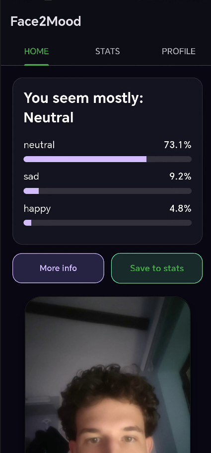

# 😊 Face2Mood: On-Device Emotional Intelligence
**A BSc Computer Science Thesis Project**

Face2Mood is a lightweight Android application for real-time **Facial Emotion Recognition (FER)** using Flutter, Google ML Kit, TensorFlow Lite, and SQLite. The project demonstrates a privacy-first approach to emotional analytics by performing all processing locally on the user's hardware.

---

## 📌 Project Context

This project was developed as part of a Bachelor's Thesis in Computer Science at the **West University of Timișoara**.

The main objective was to design and implement a complete mobile Facial Emotion Recognition system capable of running directly on Android devices without external server communication, adhering to strict privacy-by-design principles.

---

## 🚀 Repository Highlights

- **Complete Android application** with a fully functional FER pipeline.
- **Fully on-device Deep Learning inference** (Zero latency, high privacy).
- **Lightweight TensorFlow Lite model** (<1 MB) based on RS-Xception.
- **Google ML Kit integration** for robust real-time face detection.
- **SQLite local persistence** for offline mood tracking and history.
- **Interactive statistics dashboards** for emotional trends.
- **End-to-end FER pipeline**: From raw camera pixels to emotional insights.
- **Research notebooks included** (Jupyter) for full model reproducibility.
- **Ready-to-install Android APK** provided in the repository.

---

## ✨ Main Features

- **Real-time Inference**: Facial emotion recognition performed on-device.
- **On-Device Face Detection**: Powered by Google ML Kit for high-performance localization.
- **7-Class Recognition**: Predicts *Happy, Sad, Angry, Fear, Disgust, Neutral, and Surprise*.
- **Cumulative Weighted Mapping**: Statistics are calculated using the full 7-class probability spectrum for every scan, moving beyond simple "Top-1" predictions.
- **Local Persistence**: Mood history and emotional scores stored using SQLite.
- **Emotional Intelligence Dashboards**: Detailed statistics for emotion distribution and user-model agreement.
- **Privacy-First Architecture**: No cloud inference; sensitive biometric data never leaves the device.

---

## 📖 How to Use Face2Mood

After launching the application, follow these steps:

### Step 1 — Position Your Face
- Hold the smartphone approximately 30–50 cm from your face.
- Ensure your face is fully visible within the frame.
- Use good lighting conditions.
- Look directly at the camera.

### Step 2 — Capture an Emotion
Press the **Capture** button. The application will:
1. Detect the face using Google ML Kit.
2. Crop and preprocess the facial region.
3. Run the TensorFlow Lite model.
4. Display the Top-3 predicted emotions.

### Step 3 — View Detailed Analysis
Tap **More Info** to access:
- Confidence scores and emotional color palette.
- AI-driven emotion interpretation.
- Personalized psychological suggestions.

### Step 4 — Save the Result
Press **Save to Stats** to store the emotion record locally.

### Step 5 — Explore Statistics
Open the **Stats** page to view:
- Emotion distribution and most frequent emotions.
- User-model agreement metrics.
- Complete mood history.

### Step 6 — Manage Your Profile
The **Profile** page allows you to:
- View privacy information.
- Clear local mood history.
- Read application details.

> **Note:** All information remains stored locally on the device.

---

## ⚙️ Application Workflow

```text
Launch Application
        │
        ▼
Initialize Camera
        │
        ▼
```


```text
        │
        ▼
Google ML Kit Face Detection
        │
        ▼
   Face Cropping
        │
        ▼
48×48 Grayscale Conversion
        │
        ▼
TensorFlow Lite Inference
        │
        ▼
```


```text
        │
        ▼
Top-3 Emotion Predictions
        │
        ▼
```



```text
        │
        ▼
Emotion Interpretation
        │
        ▼
```


```text
        │
        ▼
Optional Save to SQLite
        │
        ▼
Statistics Dashboard
        │
        ▼
```

&nbsp;&nbsp;&nbsp;&nbsp;&nbsp;&nbsp;&nbsp;&nbsp;


```text
        │
        ▼
User Profile & Privacy
        │
        ▼
```

&nbsp;&nbsp;&nbsp;&nbsp;

---


## 🏗️ System Architecture

The application follows a **Service-Oriented Architecture (SOA)** to ensure modularity and academic rigour.

### 📂 Repository Structure
```text
Face2Mood/
├── assets/
│   └── models/              # Optimized TensorFlow Lite models (.tflite)
├── docs/
│   └── screenshots/         # UI/UX documentation images
├── lib/                     # Flutter source code
│   ├── screens/             # Presentation Layer
│   │   ├── home/            # Real-time capture and inference interface
│   │   ├── stats/           # Analytics, data visualization, and history
│   │   └── profile/         # User profile and account management
│   ├── services/            # Logic Layer (SOA)
│   │   ├── camera_service.dart             # Hardware abstraction
│   │   ├── database_service.dart           # SQLite persistence logic
│   │   ├── emotion_utils.dart              # Metadata (colors, interpretations)
│   │   ├── face_detection_mlkit_service.dart # Facial localization
│   │   ├── model_service.dart              # TFLite inference engine
│   │   └── mood_record.dart                # Data Transfer Objects (DTOs)
│   ├── main.dart            # Application entry point
│   └── main_navigation.dart # Centralized routing
├── research/                # AI Development (Jupyter Notebooks)
│   └── training_pipeline.ipynb # Model training & conversion logic
├── test/                    # Automated Verification & Validation (V&V)
│   ├── unit/                # Testing for individual service logic
│   └── integration/         # Database and data-flow verification tests
├── pubspec.yaml             # Project dependencies
└── README.md                # Project documentation
```

---

## 🧬 Deep Learning Model Evaluation

The emotion recognition model is based on a lightweight **RS-Xception** architecture trained from scratch on the **FER-2013** dataset.

| Metric | Value |
|------|------:|
| Selected Model | RSX_V2 (TFLite) |
| Validation Accuracy | 65.05% |
| Model Size | 0.91 MB |
| Inference Time | ~6.73 ms |
| Total End-to-End Time | ~513.97 ms |

### 📈 Cropped vs. Uncropped Analysis
Experimental results show that automatic face cropping using Google ML Kit significantly improves recognition performance by reducing background noise.

| Preprocessing Strategy | Top-1 Accuracy | Top-3 Accuracy |
|------------------------|--------------:|--------------:|
| Uncropped Images | 24.3% | 50.0% |
| Manually Cropped Faces | 37.1% | 68.6% |
| Automatically Cropped Faces | 42.9% | 77.1% |

---

## 🔒 Privacy & Ethics

- **On-Device Inference**: Biometric data is processed in-memory and discarded after inference.
- **Local Storage**: All emotional history is stored in a private SQLite instance.
- **Offline Functionality**: The application requires zero internet permissions for core functionality, adhering to "Privacy-by-Design" principles.

---

## 🚀 Getting Started

### Option A — Install the Application (APK)

The easiest way to try Face2Mood is to install the provided APK.

1. **Download**: `app-arm64-v8a-release.apk`
2. **Transfer** the APK to your Android phone.
3. **Enable Install from Unknown Sources** if prompted.
4. **Install** the application.
5. **Launch** Face2Mood.

> No Internet connection is required.

### Option B — Run from Source

#### Requirements

- Flutter SDK 3.x
- Android Studio
- Android SDK
- Physical Android device or emulator

#### Setup

1. **Clone repository**:
   ```bash
   git clone https://github.com/LucaSandru/Face2Mood.git
   ```
2. **Enter project**:
   ```bash
   cd Face2Mood
   ```
3. **Install dependencies**:
   ```bash
   flutter pub get
   ```
4. **Verify Flutter installation**:
   ```bash
   flutter doctor
   ```
5. **Run application**:
   ```bash
   flutter run
   ```

#### Build Release APK

```bash
flutter build apk --release --split-per-abi
```

Generated APK: `build/app/outputs/flutter-apk/`

---

## 📚 Related Publication

This repository accompanies the Bachelor's Thesis:

**Face2Mood: A Lightweight Mobile Application for Real-Time Facial Emotion Recognition**

Bachelor of Computer Science  
West University of Timișoara
2026

---

## 👨‍💻 Author

**Luca-David Șandru**  
Bachelor's Thesis Project  
Computer Science in English  
West University of Timișoara  
2026
